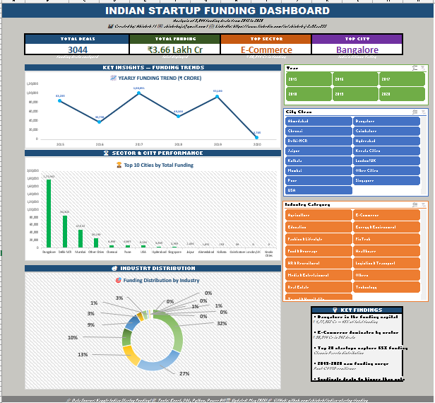

# Indian Startup Funding Analysis (2015-2020)

> End-to-end data analytics project analyzing 3,044 funding deals worth ₹3.66 Lakh Crore across India's startup ecosystem using FOUR different tools.

---

## Project Overview

This is a multi-phase data analytics project where I analyze the same Indian startup funding dataset (2015-2020) using four different tools to demonstrate proficiency across the entire data analyst stack.

The goal: show that I can take messy real-world data and turn it into actionable business insights using whatever tool the job requires.

---

## Project Status

| Phase | Tool | Status | Folder |
|-------|------|--------|--------|
| 1 | Microsoft Excel | ✅ Complete | [02_excel/](02_excel/) |
| 2 | SQL (MySQL + Python) | ✅ Complete | [03_sql/](03_sql/) |
| 3 | Python (Pandas, Matplotlib) | 🔄 Starting Soon | [04_python/](04_python/) |
| 4 | Power BI | ⏭️ Planned | [05_powerbi/](05_powerbi/) |

**This is an ACTIVE project. New phases added every 2-3 weeks.**

---

## Dataset

- **Source:** Kaggle - Indian Startup Funding (2015-2020)
- **Records:** 3,044 funding deals
- **Total Funding Analyzed:** ₹3.66 Lakh Crore (~$45 Billion USD)
- **Time Period:** January 2015 to August 2020
- **Coverage:** All major Indian startup hubs

---

## Key Findings (From Excel Phase)

After analyzing 3,044 deals, here are the patterns I discovered:

- **Bangalore captures 49% of India's startup funding** (₹1,77,962 Cr from one city alone)
- **E-Commerce dominates by sector** (₹98,314 Cr — 3x bigger than pure Technology)
- **Top 20 startups grabbed 65%+ of all funding** (extreme Pareto distribution)
- **Solo and Syndicate deals had nearly identical average sizes** (contradicting common assumptions)
- **2017 was the peak funding year** with strong recovery in 2019

Full Excel analysis with interactive dashboard: [02_excel/](02_excel/)

---

## Key Findings (From SQL Phase)

The SQL phase revealed insights Excel couldn't:

- **2015 was the peak funding year** at ₹1,62,014 Cr (popular memory says 2017 — the data disagrees)
- **The forgotten 2016 crash:** funding fell 77% while deal count INCREASED (investors cut check sizes, not bet counts)
- **32% of deals are a shadow market** — nearly 1 in 3 deals never disclosed amounts
- **Excel vs SQL totals differ by design** — documented methodology comparison in [03_sql/README.md](03_sql/README.md)

---

## Why Four Tools?

Indian data analyst job descriptions typically require:

- ✅ **Excel** — Daily reporting, pivot tables, dashboards
- ✅ **SQL** — Querying databases, joins, aggregations
- ✅ **Python** — Advanced analysis, data cleaning at scale
- ✅ **Power BI** — Interactive BI dashboards

By analyzing the SAME data with all four tools, I demonstrate:

1. The same business questions can be answered differently in each tool
2. Each tool has unique strengths (Excel for quick analysis, SQL for scale, Python for automation, Power BI for storytelling)
3. I can choose the right tool for the right job

---

## Phase 1: Excel Analysis ✅

**Folder:** [02_excel/](02_excel/)

**What's Inside:**
- `startup_funding_analysis.xlsx` — Complete interactive dashboard
- `README.md` — Full analysis report (this is the detailed write-up)
- `excel_skills_used.md` — Documentation of all Excel skills demonstrated
- `screenshots/` — Dashboard screenshots and analysis visuals

**Skills Demonstrated:**
- Pivot Tables (12+ analyses across 5 sheets)
- Nested IF + SEARCH formulas (cleaned 500+ messy industry names)
- COUNTIF with wildcards
- Interactive Dashboard with KPI cards, charts, and slicers
- Conditional Formatting with data bars
- Cross-sheet references

---

## Phase 2: SQL Analysis ✅

**Folder:** [03_sql/](03_sql/)

**What's Inside:**
- 3-stage ETL pipeline (Python regex cleaning + SQL standardization)
- `00_date_fix.sql` — Date repair script that recovered 99.9% of broken dates
- `01_data_cleaning.sql` — Standardized 500+ industries into 14 categories
- `02_exploration.sql` — Full data exploration with verified results
- Complete README documenting every bug found and fixed
- Skills documentation + Top 10 insights

**Key Findings from SQL Phase:**
- 2015 was the REAL peak funding year (₹1,62,014 Cr) — not 2017 as commonly believed
- 2016 saw a hidden 77% funding crash despite MORE deal count
- 32% of all deals never disclosed amounts
- Total disclosed funding analyzed: ₹4,45,021 Cr across 3,042 deals

**The Story Worth Reading:**
A date parsing bug silently destroyed 99.84% of my time-series data. I caught it during verification — 30 minutes before publishing wrong numbers. The full debugging story is documented in the [SQL README](03_sql/README.md).

**Skills Demonstrated:**
- Window Functions (LAG, DENSE_RANK, ROW_NUMBER, SUM OVER)
- CTEs for multi-step analysis
- CASE WHEN standardization at scale
- REGEXP pattern validation
- Python + SQL integration (SQLAlchemy)
- Honest methodology documentation (Excel vs SQL number differences explained)

---

## Phase 3: Python EDA ⏭️

**Status:** Planned

**Will Include:**
- Pandas for data manipulation
- Matplotlib + Seaborn for visualizations
- Statistical analysis (distributions, correlations)
- Jupyter Notebook with documented insights

---

## Phase 4: Power BI Dashboard ⏭️

**Status:** Planned

**Will Include:**
- Interactive multi-page dashboard
- DAX measures for advanced calculations
- Power Query for ETL
- Drill-through pages for deep analysis
- Mobile-friendly layout

---

## How to Use This Repository

### To View the Excel Analysis
1. Navigate to [02_excel/](02_excel/)
2. Download `startup_funding_analysis.xlsx`
3. Open in Microsoft Excel (Excel 365 recommended)
4. Use the slicers on the Dashboard sheet to filter data interactively

### To Read the Detailed Report
- Each phase folder has its own `README.md` with full analysis

### To Run the SQL Queries (Coming Soon)
- Phase 2 folder will include setup instructions

---

## Tech Stack

**Phase 1 (Done):** Microsoft Excel 365  
**Phase 2 (Current):** MySQL Workbench, Python 3.11, Pandas, SQLAlchemy  
**Phase 3 (Planned):** Python, Pandas, NumPy, Matplotlib, Seaborn, Jupyter  
**Phase 4 (Planned):** Power BI Desktop, DAX, Power Query

---

## About the Author

**Abishek J** — Aspiring Data Analyst transitioning from Java development.

I build real-world data analytics projects to demonstrate practical skills. Each project uses actual Indian datasets with real-world cleaning challenges.

**Currently:** 🔭 Open to Junior Data Analyst / Business Analyst roles | 📍 Bangalore, Coimbatore & Relocation

### Connect With Me

- 💼 LinkedIn: [linkedin.com/in/abishek-j-2a32aa255](www.linkedin.com/in/abishek-j-2a32aa255)
- 📧 Email: abishekvja@gmail.com
- 🐙 GitHub: [More projects on my profile](https://github.com/Abhishek-j-0)

---

## Project Timeline

- **March 2026:** Started data analytics learning journey
- **May 2026:** Built first practice project (Supermarket Sales Dashboard)
- **May 2026:** Completed Excel phase of Indian Startup Funding
- **May 2026:** Completed SQL phase — 3-stage ETL pipeline + full analysis
- **June 2026:** Python EDA phase (starting)
- **Coming:** Power BI phase
- **Target:** Complete portfolio by end of 2026

---

## License

This project is open for learning purposes. Feel free to explore, learn from it, and build your own version.

---

⭐ **If you find this work useful, please star the repository!**

📌 **Following this project?** Watch the repo to get notified when new phases are added.
